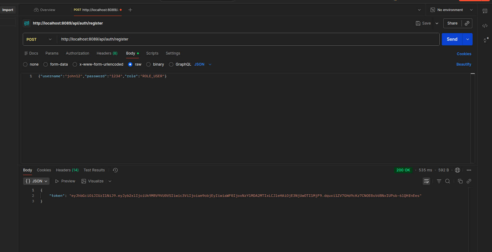
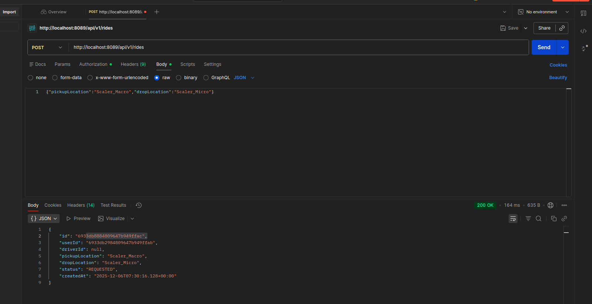
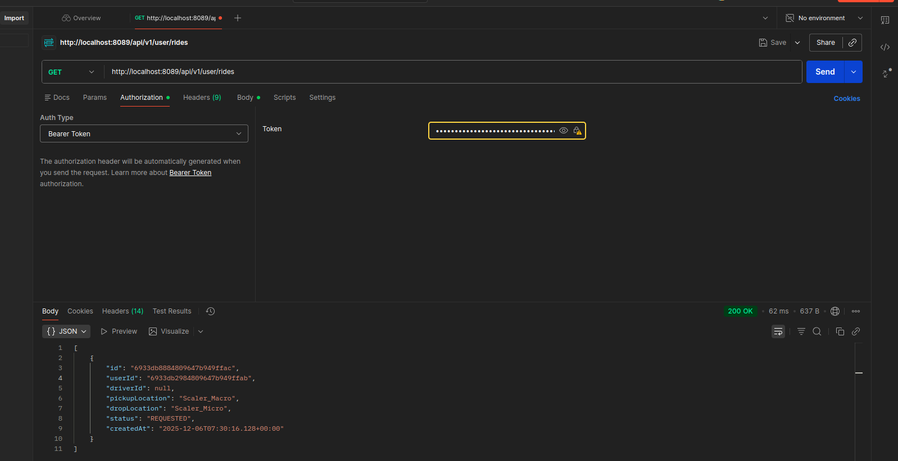
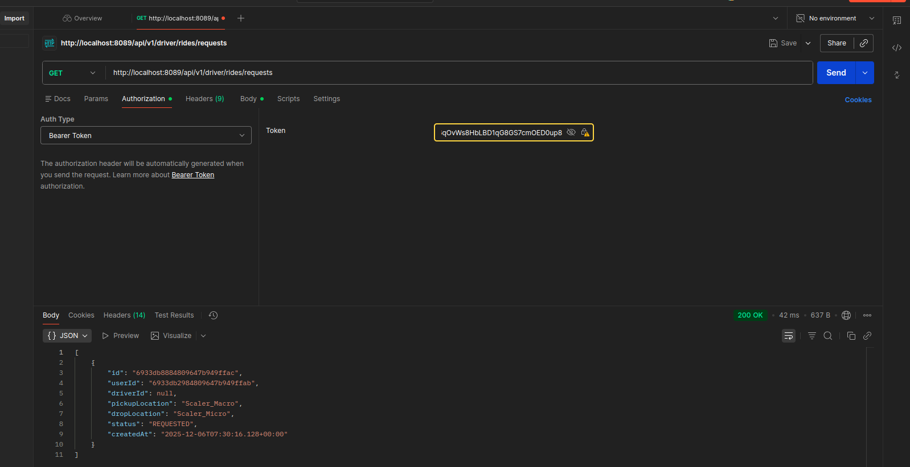
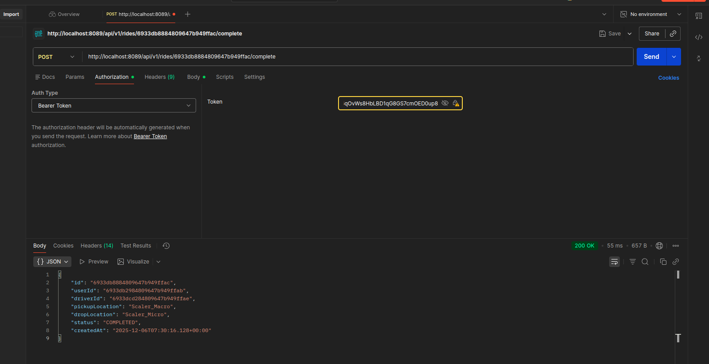

#  Uber Backend

A backend system for a ride-sharing platform built with **Spring Boot** and **MongoDB**.  
Supports **user authentication**, **ride management**, and **role-based access** for drivers and passengers.

---

##  Features
- **User Authentication**: Register & Login with JWT  
- **Role-based Access**: Passenger & Driver  
- **Ride Management**: Request, Accept, Complete rides  
- **Validation & Error Handling**: Input validation & global exception handling  
- **Secure API**: JWT token-based authorization for protected routes  

---

## Prerequisites
- **Java 21**  
- **MongoDB** running locally on `localhost:27017`  

---

##  Running the Application
1. Clone the repository:
   ```bash
   git clone https://github.com/Naren456/uber-backend
   cd uber-backend


## API Endpoints

### Authentication (Public)
| Method | Endpoint | Description |
|--------|----------|-------------|
| POST | `/api/auth/register` | Register new user (Passenger/Driver) |
| POST | `/api/auth/login` | Login and get JWT Token |

### Passenger (Requires ROLE_USER)
| Method | Endpoint | Description |
|--------|----------|-------------|
| POST | `/api/v1/rides` | Request a new ride |
| GET | `/api/v1/user/rides` | View my requested rides |

### Driver (Requires ROLE_DRIVER)
| Method | Endpoint | Description |
|--------|----------|-------------|
| GET | `/api/v1/driver/rides/requests` | View all pending ride requests |
| POST | `/api/v1/driver/rides/{id}/accept` | Accept a ride request |

### Common (Authenticated)
| Method | Endpoint | Description |
|--------|----------|-------------|
| POST | `/api/v1/rides/{id}/complete` | Mark a ride as completed |

## Postman Screenshots

### User Workflow
**Register User**


**Create Ride**


**View User Rides**


### Driver Workflow
**Register Driver**


**View Pending Requests**


**Accept Ride**


**Complete Ride**



